**FALLOW** (***F**orest, **A**groforest, **L**ow-value **L**and **O**r **W**asteland*) is a landscape-dynamics model, which comprises the following main annual dynamic processes: (1) plot-level soil fertility dynamics in crop and fallow phases affecting agricultural crop production; (2) food storage, use and sale at the village level, with options along the spectrum from 'full dependence on local food production' to 'fully market integrated' economy; (3) farmer decisions on increase or decrease of the area cropped, depending on labour availability and expected profitability of various land use options, as they have learnt from past experiences within the simulation; (4) spatial implementation of choices for clearing land, choosing among the options available; and (5) impact assessment of how the resultant mosaic of land cover types and successional processes will affect watershed functions (annual water yield, base flow, net sediment loss), biodiversity indicators and carbon stocks.

Initially developed in Stella and PCRaster, FALLOW has now been re-implemented in R using Shiny web GUI. FALLOW can be used for impact assessment and scenario studies, assisting the negotiation process between stakeholders in a changing landscape by visualizing possible/likely consequences of factors such as changes in prices, population density and human migration, availability of new technology, spatial zoning of land use, pest and disease pressure or climate.

### Example on FALLOW application

#### Reconstruct historical pathway of land-use/cover change

In this example, simulation was initialized from totally forested landscape, which was occupied by 5 inhabitants/km2 of people who had a relatively adaptive learning style. Human population increased according to natural growth and migration that were determined by food sufficiency and returns to labour respectively. Shifting cultivation was the first livelihood recognised in the area, which fallow duration was affected directly by food need. Market had been introduced at this early stage. People then adopted coffee agroforestry and NTFP gathering activities as alternative livelihoods. Later, agroforestry development led to tenure recognition and land privatisation, through which people had the power to exchange their lands, which might lead to increase land-holding size to start adopting more modern type of production system, which was monoculture coffee plantation. In more profit-oriented type of people, market dynamics could trigger people to alter tree-based production systems into horticultural production systems, which was more promising in term of profit that could be earned in relatively shorter time. And the results of simulation for 100 years are:

#### Land-use/cover change in space...

-   Initial cropping activities in year-3 (orange cells)

    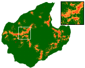

-   Initial agroforestry development in year-6 (banana yellow cells)

    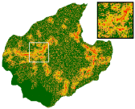

-   Initial coffee monoculture development in year-26 (blue cells)

    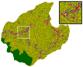

-   Initial horticulture development in year-56 (light grey cells)

    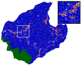

#### Land-use/cover change in time...

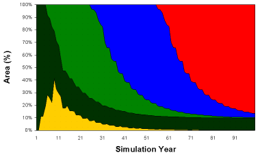

Simulated land-use/cover change for 1 century period. Yellow is cropped fields, dark green is forested area, green is agroforest, blue is coffee monoculture, and red is horticulture. Remaining forested area was protected forests.

#### Impact on carrying capacity...

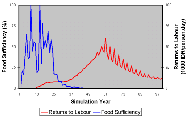

In term of food sufficiency¸ carrying capacity of the landscape crashed at the population density of about 154 inhabitants/km2 around year-25. In term of returns to labour, attractiveness of the landscape crashed when people started to adopt horticultural system around year-56, since such system exploited soil fertility at relatively high degree.

#### Impact on watershed functions...

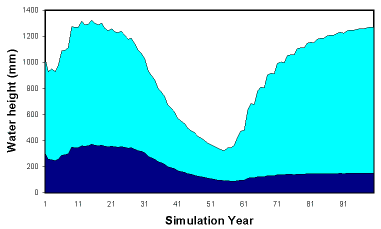

Due to relatively higher water use, agroforestry and plantation types of vegetations yielded lower water yield (cyan) compared to horticulture, while those two tree-based production systems could maintain soil physical properties, so that they could result relatively higher baseflow (dark blue).

#### Another impact on watershed functions...

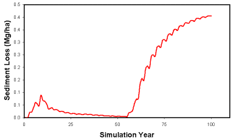

In term of sediment loss, tree-based production systems of agroforestry and plantation could decrease sediment loss.

#### Impact on biodiversity...

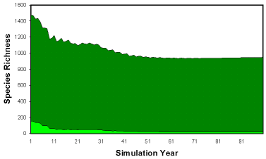

Since the development of monoculture plantations, either plot-level biodiversity (light green) or landscape-level biodiversity (green) decreased. Remaining forest reserve could maintain biodiversity level.

#### Impact on carbon stocks...

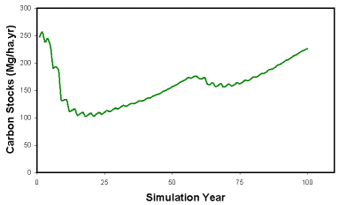

Triggered by coffee monoculture booming, carbon stocks of the landscape declined mainly due to land-clearing and dynamic land conversion. Increase was caused by remaining forest reserve.

#### Cultivated crop type as function of soil fertility...

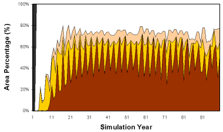

As preference on the type of cultivated crops reflected on how people adapted to changing soil fertility, cassava (red brown) dominated cropping area when soil fertility declined, since cassava has wider range adaptability to soil fertility. Initially, people preferred to cultivate rice (white). Yellow is maize, light brown is groundnut.
